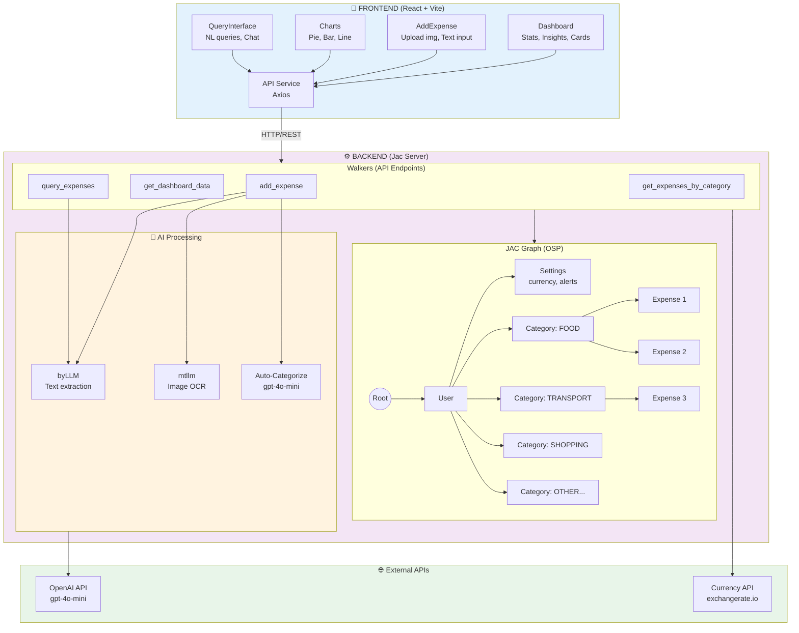
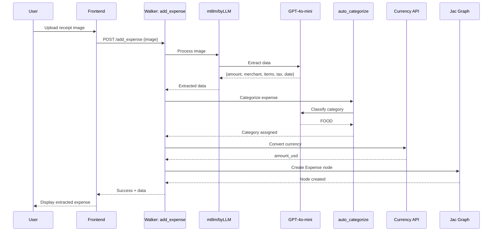
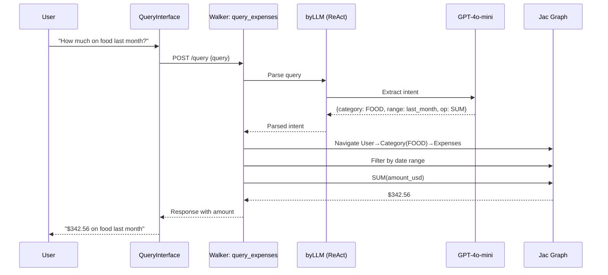
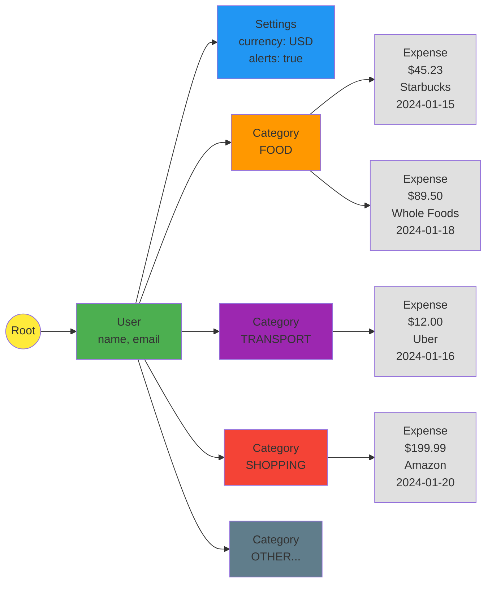

# 🎯 Smart Expense Tracker - Implementation Plan

## 🎨 System Architecture Overview

```
┌─────────────────────────────────────────────────────────────────────────────┐
│                           FRONTEND (React + Vite)                           │
├─────────────────────────────────────────────────────────────────────────────┤
│                                                                             │
│  ┌─────────────┐  ┌──────────────┐  ┌────────────┐  ┌──────────────────┐  │
│  │  Dashboard  │  │ AddExpense   │  │   Charts   │  │ QueryInterface   │  │
│  │             │  │              │  │            │  │                  │  │
│  │ • Stats     │  │ • Upload img │  │ • Pie      │  │ • NL queries     │  │
│  │ • Insights  │  │ • Text input │  │ • Bar      │  │ • Chat response  │  │
│  │ • Cards     │  │ • Category   │  │ • Line     │  │                  │  │
│  └─────────────┘  └──────────────┘  └────────────┘  └──────────────────┘  │
│         │                  │                │                   │           │
│         └──────────────────┴────────────────┴───────────────────┘           │
│                                     │                                       │
│                            ┌────────▼────────┐                              │
│                            │   API Service   │                              │
│                            │   (Axios)       │                              │
│                            └────────┬────────┘                              │
└─────────────────────────────────────┼───────────────────────────────────────┘
                                      │
                                 HTTP/REST
                                      │
┌─────────────────────────────────────▼───────────────────────────────────────┐
│                          BACKEND (Jac Server)                               │
├─────────────────────────────────────────────────────────────────────────────┤
│                                                                             │
│  ┌──────────────────────────── WALKERS (API) ───────────────────────────┐  │
│  │                                                                       │  │
│  │  add_expense    get_dashboard_data    query_expenses                 │  │
│  │       │                  │                    │                      │  │
│  │       └──────────────────┴────────────────────┘                      │  │
│  │                          │                                           │  │
│  └──────────────────────────┼───────────────────────────────────────────┘  │
│                             │                                              │
│  ┌──────────────────────────▼──────────────────────────────────────────┐  │
│  │                    JAC GRAPH DATABASE (OSP)                          │  │
│  │                                                                      │  │
│  │              ┌─────┐                                                 │  │
│  │              │Root │                                                 │  │
│  │              └──┬──┘                                                 │  │
│  │                 │                                                    │  │
│  │            ┌────▼────┐                                               │  │
│  │            │  User   │                                               │  │
│  │            └────┬────┘                                               │  │
│  │                 │                                                    │  │
│  │        ┌────────┴─────────┐                                          │  │
│  │        │                  │                                          │  │
│  │   ┌────▼─────┐      ┌────▼────────┐                                 │  │
│  │   │ Settings │      │  Category   │ (FOOD, TRANSPORT, etc.)         │  │
│  │   │          │      │  (x9)       │                                 │  │
│  │   │ • currency│     └────┬────────┘                                 │  │
│  │   │ • alerts  │          │                                          │  │
│  │   └──────────┘           │                                          │  │
│  │                     ┌────▼────────┐                                 │  │
│  │                     │  Expense    │ (amount, merchant, date...)     │  │
│  │                     │  (many)     │                                 │  │
│  │                     └─────────────┘                                 │  │
│  │                                                                      │  │
│  └──────────────────────────────────────────────────────────────────────┘  │
│                                                                             │
│  ┌───────────────────────── AI PROCESSING ─────────────────────────────┐  │
│  │                                                                      │  │
│  │  ┌──────────┐         ┌───────────┐         ┌──────────────────┐   │  │
│  │  │  byLLM   │         │   mtllm   │         │  Auto-Categorize │   │  │
│  │  │          │         │           │         │                  │   │  │
│  │  │ Text → $ │         │ Image → $ │         │  Expense → Cat   │   │  │
│  │  │ merchant │         │ merchant  │         │                  │   │  │
│  │  │ date     │         │ items     │         │  (gpt-4o-mini)   │   │  │
│  │  └──────────┘         └───────────┘         └──────────────────┘   │  │
│  │                                                                      │  │
│  │  Model: gpt-4o-mini / claude-3-5-haiku                              │  │
│  │                                                                      │  │
│  └──────────────────────────────────────────────────────────────────────┘  │
│                                                                             │
└─────────────────────────────────────────────────────────────────────────────┘
                                      │
                    ┌─────────────────┴─────────────────┐
                    │                                   │
          ┌─────────▼────────┐              ┌───────────▼──────────┐
          │ Currency API     │              │   OpenAI API         │
          │ (exchangerate.io)│              │   (gpt-4o-mini)      │
          │                  │              │                      │
          │ Real-time rates  │              │   AI extraction      │
          └──────────────────┘              └──────────────────────┘
```

## 🔄 Data Flow Diagrams

### **Add Expense Flow (Image)**
```
User uploads receipt
         │
         ▼
  [Frontend: AddExpense]
         │
         ▼ HTTP POST /add_expense
  [Walker: add_expense]
         │
         ▼
    [mtllm] ──────► GPT-4o-mini
         │           (Vision API)
         │◄──────────┘
         │ Extract: amount, merchant, items, tax, date
         ▼
  [auto_categorize]
         │
         ▼ byLLM
    Assign category (FOOD, TRANSPORT, etc.)
         │
         ▼
  [Currency conversion]
         │
         ▼ Exchange API
    Convert to USD
         │
         ▼
  [Create Expense node] ──► Graph: User → Category → Expense
         │
         ▼ Response
  [Frontend shows success + extracted data]
```

### **Natural Language Query Flow**
```
User: "How much did I spend on food last month?"
         │
         ▼
  [QueryInterface]
         │
         ▼ HTTP POST /query_expenses
  [Walker: query_expenses]
         │
         ▼
    [byLLM with ReAct]
         │
    Parse intent:
    • Category: FOOD
    • Time range: Last month
    • Aggregation: SUM
         │
         ▼
  [Graph traversal]
    Navigate: User → Category(FOOD) → Expenses
    Filter by date range
    Calculate SUM(amount_usd)
         │
         ▼ Response
  [Frontend displays: "$342.56 on food last month"]
```

### **Dashboard Data Flow**
```
User opens Dashboard
         │
         ▼
  [Dashboard component]
         │
         ▼ HTTP GET /dashboard_data
  [Walker: get_dashboard_data]
         │
         ├──► Traverse all Categories
         │    ├─► Sum expenses per category (Pie chart)
         │    └─► Group by month (Bar chart - 6 months)
         │
         ├──► Calculate total spending (current month)
         │
         ├──► Find biggest category (Insight)
         │
         └──► Compare to previous month (% change)
         │
         ▼ JSON Response
  [Frontend renders:
    • Stats cards
    • Pie chart (Recharts)
    • Bar chart (6-month trend)
    • Insight card]
```

## 📊 Mermaid Diagrams

### **System Architecture (Mermaid)**


### **Add Expense Flow (Mermaid)**


### **Natural Language Query Flow (Mermaid)**


### **Graph Structure (Mermaid)**


## 📁 Project Structure
```
expense-tracker/
├── backend/
│   ├── main.jac              # Node/Walker interfaces
│   ├── main.impl.jac         # Implementation details
│   ├── utils.jac             # Utility functions (currency conversion, datetime)
│   ├── requirements.txt      # Python dependencies
│   └── .env                  # Environment variables
├── frontend/
│   ├── public/
│   ├── src/
│   │   ├── components/
│   │   │   ├── AddExpense.jsx      # Receipt upload + manual entry
│   │   │   ├── Dashboard.jsx       # Main dashboard with stats
│   │   │   ├── Charts.jsx          # Pie, Bar, Line charts
│   │   │   ├── QueryInterface.jsx  # Natural language query
│   │   │   └── CategorySelector.jsx
│   │   ├── services/
│   │   │   └── api.js              # Backend API calls
│   │   ├── App.jsx
│   │   └── main.jsx
│   ├── package.json
│   └── vite.config.js
└── README.md
```

## 🏗️ Backend Architecture (Jac)

### **Graph Structure**
```
root
 └──> User (single user for MVP)
       ├──> Settings (currency preference, budget alerts)
       └──> Category (predefined + custom)
             └──> Expense (amount, merchant, date, items, currency, notes)
```

### **Nodes**
1. **User** - User settings, preferences
2. **Settings** - Currency preference, notification settings
3. **Category** - Food, Transport, Entertainment, Shopping, Bills, Health, etc.
4. **Expense** - Individual expense records with detailed extraction

### **Walkers (API Endpoints)**
1. **add_expense** - Add expense (text/image)
2. **get_dashboard_data** - Return stats for dashboard
3. **query_expenses** - Natural language queries
4. **get_expenses_by_category** - For line chart visualization
5. **update_settings** - Change currency preference

### **Key Features**
- **Multimodal AI**: Process receipt images (mtllm) and text descriptions
- **Detailed Extraction**: Amount, merchant, date, items, tax, total
- **Currency Conversion**: Real-time USD conversion, user-selectable display currency
- **Smart Categorization**: AI auto-categorizes with user override
- **Insights**: Biggest spending category, trends, comparisons

## 🎨 Frontend Architecture (React)

### **Pages/Components**
1. **Dashboard**
   - Total spending (current month)
   - Category breakdown (Pie chart)
   - Spending trend (Bar chart - last 6 months)
   - Biggest money eater insight
   - Quick stats cards

2. **Add Expense**
   - Image upload area (drag & drop)
   - OR text input field
   - Category dropdown (auto-suggested + manual override)
   - Loading state during extraction
   - Success/error feedback

3. **Query Interface**
   - Natural language input
   - Example queries shown
   - Chat-like response display

4. **Category View**
   - Select category dropdown
   - Line chart showing spending trend in selected category
   - List of expenses in that category

### **Tech Stack**
- **React** with Vite (fast dev server)
- **Recharts** (charts - lightweight, easy)
- **Tailwind CSS** (beautiful, responsive styling)
- **React Dropzone** (image upload)
- **Axios** (API calls)

## 🔧 Implementation Steps

### **Phase 1: Backend Core (Jac)**
1. Setup project structure, .env, requirements.txt
2. Define enums (CategoryEnum, CurrencyEnum)
3. Create nodes (User, Settings, Category, Expense)
4. Implement utility functions (currency converter, datetime parser)
5. Create walker: `add_expense_text` (text-based first)
6. Test with manual API calls

### **Phase 2: Backend AI Features**
7. Implement `extract_expense_from_text` (byLLM with ReAct)
8. Implement `auto_categorize` (byLLM classification)
9. Add currency conversion logic (use API like exchangerate-api.io)
10. Create walker: `add_expense_image` (mtllm for receipt OCR)
11. Test multimodal extraction

### **Phase 3: Backend Querying & Analytics**
12. Implement `get_dashboard_data` walker (aggregation logic)
13. Implement `query_expenses` (natural language to graph queries)
14. Implement `get_expenses_by_category` (for line chart)
15. Add insights logic (biggest spender, trends)

### **Phase 4: Frontend Setup**
16. Initialize React + Vite project
17. Setup Tailwind CSS
18. Create component folder structure
19. Setup API service layer
20. Create routing (if multi-page)

### **Phase 5: Frontend Components**
21. Build AddExpense component (text input + image upload)
22. Build Dashboard with stats cards
23. Integrate Recharts (Pie, Bar, Line charts)
24. Build QueryInterface component
25. Add category selector for line chart view

### **Phase 6: Integration & Polish**
26. Connect all frontend components to backend APIs
27. Add loading states, error handling
28. Add success/error notifications
29. Make responsive for mobile
30. Add smooth transitions/animations

### **Phase 7: Testing & Demo Prep**
31. Test all workflows (text, image, queries)
32. Add sample data for demo
33. Test currency conversion edge cases
34. Create demo script for video
35. Final polish (styling, UX improvements)

## 🔑 Key Technologies

### **Backend**
- Jac (OSP + byLLM)
- mtllm (multimodal AI - receipt images)
- byllm (text extraction, categorization, queries)
- OpenAI API (gpt-4o or gpt-4o-mini)
- Currency API (exchangerate-api.io - free tier)
- Python libs: Pillow (image processing), python-dotenv

### **Frontend**
- React 18 + Vite
- Tailwind CSS
- Recharts
- React Dropzone
- Axios
- React Router (if needed)

## 📊 Data Models

### **Expense Node**
```jac
node Expense {
    has amount: float;
    has currency: str;           // Original currency (USD, EUR, etc.)
    has amount_usd: float;       // Converted to USD
    has merchant: str;
    has date: str;               // YYYY-MM-DD
    has time: str;               // HH:MM:SS
    has items: list[str];        // Extracted line items
    has tax: float;
    has notes: str;
    has created_at: str;
}
```

### **Category Enum**
```jac
enum CategoryEnum {
    FOOD, TRANSPORT, ENTERTAINMENT,
    SHOPPING, BILLS, HEALTH, EDUCATION,
    TRAVEL, OTHER
}
```

## 🎯 Success Criteria
- ✅ Upload receipt image → AI extracts all details
- ✅ Type expense description → AI extracts amount, category
- ✅ Dashboard shows accurate stats and beautiful charts
- ✅ Natural language queries work smoothly
- ✅ Currency conversion works in real-time
- ✅ UI is polished, responsive, and delightful to use
- ✅ Video demo highlights Jac's power

## ⏱️ Estimated Timeline
- Backend Core: 2 hours
- Backend AI: 2 hours
- Backend Analytics: 1.5 hours
- Frontend Setup: 1 hour
- Frontend Components: 3 hours
- Integration & Polish: 2 hours
- Testing & Demo Prep: 1.5 hours
**Total: ~13-15 hours** (can be split across 2-3 sessions)

---

## 🎬 Video Script Outline (10-12 minutes)

### **Act 1: The Problem (1 min)**
- "I spend money every day but have no idea where it goes"
- Show messy pile of receipts
- "Traditional expense trackers are too manual and boring"

### **Act 2: The Solution - Jac Language (2 min)**
- Quick intro to Jac programming language
- Key features: Object Spatial Programming, AI-first with byLLM
- "Let's build a smart expense tracker that understands receipts"

### **Act 3: Building the Backend (3-4 min)**
- Show graph structure visualization
- Code walkthrough (time-lapse with voiceover):
  - Creating nodes (User, Category, Expense)
  - byLLM for receipt extraction
  - mtllm for image processing
  - Natural language queries
- Highlight key Jac features: `by llm()`, graph navigation, walkers

### **Act 4: The React Frontend (2 min)**
- Quick montage of building UI
- Show Tailwind + Recharts integration
- Focus on the beautiful end result, not code details

### **Act 5: The Demo (3 min)**
- Upload a real receipt photo → Watch AI extract everything
- Type text expense → Auto-categorization
- Dashboard overview → Charts update in real-time
- Natural language query: "How much did I spend on food this month?"
- Show currency conversion in action
- "What's my biggest money eater?" → Insight appears

### **Act 6: The Reveal (1 min)**
- Show the graph structure with data
- "Built in [X] hours with Jac"
- Show GitHub repo, call to action
- "This is just scratching the surface of what Jac can do"

---

Ready to start building! 🚀
